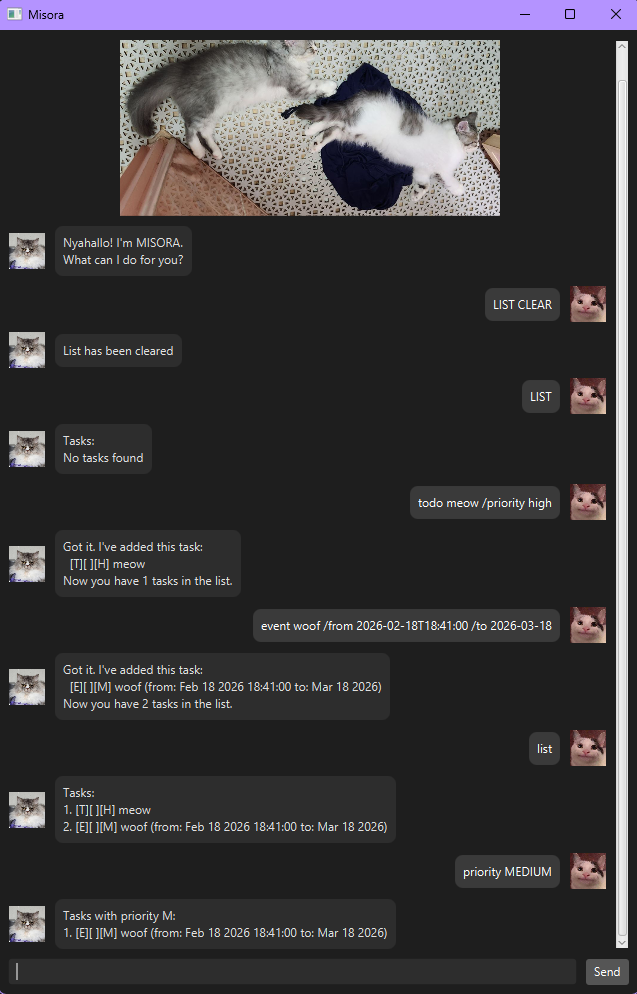

# MISORA User Guide



## Introduction

Misora is a lightweight command-line task management application designed to help users organise tasks efficiently.

It supports:

- Adding todos, deadlines, and events

- Setting task priorities

- Marking and unmarking tasks

- Finding tasks by keyword, date, or priority

- Deleting and clearing tasks

Misora is designed for users who prefer typing commands over using a graphical interface.

## Quick Start

1. Ensure you have Java 17 or later installed.

2. Download the latest misora.jar.

3. Open a terminal in the folder containing the .jar file.

4. Run java -jar misora.jar

5. Start entering commands!

## Features

### List All Tasks

Example: 

`list`

Displays all tasks currently stored.
```
//if have tasks
Tasks:
1. [T][ ][M] read book
2. [E][ ][H] project meeting (from: Feb 01 2026 to: Feb 02 2026)
3. [D][ ][H] submit report (by: Feb 01 2026)

//if no tasks
Tasks:
No tasks found
```

### Clear All Tasks From List

Example: 

`list clear`

Clears all the tasks from the list
```
List has been cleared
```

### Add ToDo Task

Example: 

`todo meow`

`todo meow (/priority low)`

Adds a ToDo task
```
Got it. I've added this task:
  [T][ ][H] meow
Now you have 1 tasks in the list.
```

### Add Deadline Task

Example:

`deadline meow /by today (/priority low)`

`deadline woof /by 2026-02-18 (/priority medium)`

`deadline woof /by 2026-02-18T20:21:21 (/priority high)`

Adds a Deadline task.
```
Got it. I've added this task:
  [D][ ][H] woof (by: Feb 18 2026 20:21:21)
Now you have 1 tasks in the list.
```

### Add Event Task

Example:

`event meow /from today /to tmr (/priority low)`

`event woof /from 2026-02-18 /to 2026-02-19 (/priority medium)`

`event woof /from 2026-02-18T20:21:21 /to 2026-02-19 (/priority high)`

Adds a Event task.
```
Got it. I've added this task:
  [E][ ][H] woof (from: Feb 18 2026 20:21:21 to: Feb 19 2026)
Now you have 1 tasks in the list.
```

### Mark Task as Done

Example:

`mark 2`

Marks the task at the (given number + 1) index in the list as done
```
Nice! I've marked this task as done:
  [T][X][H] meow
```

### Mark Task as Not Done

Example:

`unmark 2`

Marks the task at the (given number + 1) index in the list as not done yet
```
OK, I've marked this task as not done yet:
  [T][ ][H] meow
```

### Delete Task

Example:

`delete 2`

Deletes the task at the (given number + 1) index in the list
```
Noted. I have removed this task:
  [T][ ][H] meow
Now you have 1 tasks in list.
```

### Find Tasks on Date

Example:

`date 2026-02-18`

Finds tasks containing the given date
```
Tasks on 2026-02-18:
1. [E][ ][M] woof (from: Feb 18 2026 18:41:00 to Mar 18 2026)
```

### Find Tasks Containing String

Example:

`find woof`

Finds tasks containing the given string
```
Tasks containing woof:
1. [E][ ][M] woof (from: Feb 18 2026 18:41:00 to Mar 18 2026)
```

### Find Tasks With Priority

Example:

`priority medium`

Finds tasks containing the given string
```
Tasks with priority M:
1. [E][ ][M] woof (from: Feb 18 2026 18:41:00 to Mar 18 2026)
```

// Give examples of usage

Example: `keyword (optional arguments)`

// A description of the expected outcome goes here

```
expected output
```